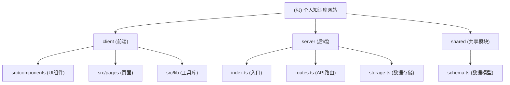

# 个人知识库网站 - AI 上下文

## 项目愿景
一个完整的全栈 Markdown 知识库网站，支持文章编辑、版本历史、评论系统、多格式导出和多种代码配色主题，帮助用户高效管理和分享知识。

## 架构总览
这是一个前后端分离的项目，采用模块化设计：
- **前端**: React + TypeScript + Tailwind CSS + Shadcn UI
- **后端**: Express.js + Drizzle ORM
- **共享层**: 数据模型定义与验证
- **数据存储**: PostgreSQL (配置为开发环境)

## 模块结构图



## 模块索引

| 模块   | 路径          | 职责                  |
| ---- | ----------- | ------------------- |
| 前端   | `client/`   | 提供用户界面和交互体验        |
| 后端   | `server/`   | 提供API服务和数据处理        |
| 共享模块 | `shared/`   | 定义数据模型和验证规则        |

## 运行与开发

### 开发环境
```bash
npm install
npm run dev
```

### 生产构建
```bash
npm run build
npm start
```

## 测试策略
- 前端: React Query 用于API测试
- 后端: 直接调用API端点测试
- 手动测试核心功能：文章编辑、版本历史、评论、导出

## 编码规范
- TypeScript 语法
- Tailwind CSS 样式
- Shadcn UI 组件库
- 模块化设计

## AI 使用指引
- 生成单元测试
- 优化API性能
- 解释复杂代码逻辑
- 提供技术方案建议

## 变更记录 (Changelog)
- 2025-11-29: 初始 AI 上下文文档创建
